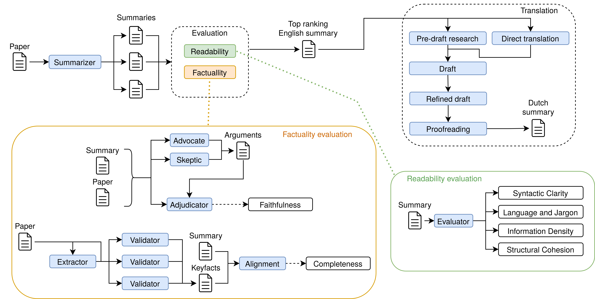

# Wetenschap in begrijpelijke taal

> Wetenschappelijke open-accessartikelen begrijpelijk maken voor Nederlandstalige niet-academische doelgroepen met behulp van open en betrouwbare generatieve AI.

Deze repository documenteert **Wetenschap in begrijpelijke taal**, een samenwerking tussen:

- [KB Nationale Bibliotheek](https://www.kb.nl/)
- [Vrije Universiteit Amsterdam – Universiteitsbibliotheek](https://www.ub.vu.nl/)
- [VU AI & Behaviour-groep](https://vu.nl/nl/over-vu/meer-over/artificial-intelligence)
- [Parlement & Wetenschap](https://www.knaw.nl/nl/over-de-knaw/wat-doet-de-knaw/parlement-wetenschap)
- [SKILS – praktijk voor psychologie & coaching](https://www.skils.nl/)
- [SURF – AI-hub & Research Cloud](https://www.surf.nl/nl)

Het project onderzoekt hoe **large language models (LLM’s)** **betrouwbare en begrijpelijke publieksvriendelijke samenvattingen** van wetenschappelijke artikelen in het Nederlands kunnen genereren, afgestemd op echte gebruikers zoals **GZ-psychologen** en **beleidsadviseurs** in het Nederlandse parlement. 

---

---

## Inhoudsopgave

1. [Motivatie](#motivatie)  
2. [Projectdoelen](#projectdoelen)  
3. [Wat we bouwen](#wat-we-bouwen)  
   - [AI-pijplijn & methodiek](#ai-pijplijn--methodiek)  
   - [Demotool (prototype)](#demotool-prototype)  
   - [Open code, prompts & data](#open-code-prompts--data)  
4. [Resultaten](#resultaten)  
5. [Aanbevelingen](#aanbevelingen)  
6. [Onderzoekskader](#onderzoekskader)  
7. [Projectorganisatie](#projectorganisatie)  
8. [Tijdlijn & status](#tijdlijn--status)  
9. [Gerelateerde repositories & projecten](#gerelateerde-repositories--projecten)  
10. [Citeren](#citeren)  
11. [Contact](#contact)  
12. [Licentie](#licentie)  

---

## Motivatie

Open science heeft ervoor gezorgd dat steeds meer onderzoeksartikelen **vrij toegankelijk** zijn, maar daarmee nog niet **begrijpelijk**.

- Ongeveer **40% van open-accessartikelen wordt gelezen door niet-academische doelgroepen** (docenten, zorgprofessionals, beleidsmakers, burgers).  
  Zie *Open for All: Exploring the reach of open access content to non-academic audiences* (Wirsching et al., 2020).  
  <https://doi.org/10.5281/zenodo.4143313>
- Deze lezers hebben vaak moeite met **jargon, complexe zinnen en abstract taalgebruik**.
- Tegelijkertijd verspreidt **desinformatie** zich makkelijk online omdat het vaak wordt geschreven in **eenvoudige, aansprekende taal**.

Onderzoekers worden ondertussen steeds vaker gevraagd om:

- **maatschappelijke impact** aantoonbaar te maken,
- **wetenschapscommunicatie** en **public engagement** te doen,
- en onderzoeksresultaten toegankelijk te maken voor een breed publiek.

Maar goede publieksvriendelijke samenvattingen schrijven is **tijdrovend** en vraagt specifieke vaardigheden.

Generatieve AI biedt een kans — maar huidige tools zijn **niet transparant, niet altijd betrouwbaar, en vaak afhankelijk van Big Tech**. We hebben **open, toetsbare en publieke** alternatieven nodig.

---

## Projectdoelen

Het project ontwikkelt en valideert een **AI-gebaseerde methode** die:

1. **Nederlandse publieksvriendelijke samenvattingen** genereert van wetenschappelijke artikelen, afgestemd op:
   - GZ-psychologen en zorgprofessionals,
   - beleidsmedewerkers in parlement en ministeries,
   - andere niet-academische professionals.
2. Waar mogelijk gebruikmaakt van **open en/of publiek beheerde LLM’s** (zoals [WiLLMa – GPT-NL](https://www.gpt-nl.nl/), via [SURF AI-hub](https://www.surf.nl/nl)).
3. Volledig **transparant en reproduceerbaar** is:
   - open prompts,
   - open code,
   - gedocumenteerde pijplijn en evaluatiemethodiek.
4. **Sterk leunt op de brontekst**:
   - zo min mogelijk hallucinaties,
   - behoud van nuance.
5. **Schaalbaar** is voor bibliotheken en contentplatforms.

Zo willen we de kloof tussen open access en **echte toegankelijkheid** verkleinen en de rol van bibliotheken als **betrouwbare intermediairs** versterken. 

---

## Wat we bouwen

### AI-pijplijn & methodiek

De pijplijn genereert eerst meerdere kandidaat-samenvattingen uit hetzelfde artikel en kiest daarna de beste voor vertaling naar het Nederlands.

*Samenvatting (linksboven), leesbaarheidsevaluatie (rechtsonder), feitelijkheidsevaluatie (linksonder) en vertaling (rechtsboven).*

- **Prompt engineering & persona’s**  
  Doelgroepgerichte prompts (bv. *“Leg dit uit aan een Nederlandse GZ-psycholoog”*, *“Leg dit uit aan een beleidsadviseur”*).  
  Zie de daadwerkelijke prompts per doelgroep: <https://github.com/ubvu/wibt-tool/tree/main/prompts>
- **Meerdere open LLM’s**  
  gpt-oss-120b en Gemma3-12b voor samenvatting en evaluatie, TranslateGemma-12b als basis voor de vertaling. Deze modellen zijn beschikbaar gesteld via Nebula, het LLM-platform van de VU, en de AI-Hub van SURF.
- **LLM-as-a-judge voor leesbaarheid**  
  Eén evaluatie-agent scoort elke samenvatting op zinsbouw, taal/jargon, informatiedichtheid en structuur.
- **Advocate/Skeptic/Adjudicator voor feitelijkheid**  
  Twee agents beargumenteren per zin vóór en tegen of die uit het bronartikel volgt; een derde agent (de Adjudicator) beslist.
- **Evaluatie met echte gebruikers**  
  - feitelijke juistheid door de oorspronkelijke auteurs en onafhankelijke domeinexperts,
  - leesbaarheid & bruikbaarheid door GZ-psychologen en informatiespecialisten van de Tweede Kamer.

---

### Demotool (prototype)

We bouwden een **onderzoeksprototype** waarmee gebruikers:

1. Een wetenschappelijk artikel kunnen uploaden (PDF).  
2. Een **doelgroep** kunnen kiezen (algemeen, GZ-psycholoog, of informatiespecialist Tweede Kamer).  
3. Een samenvatting kunnen genereren:
   - een gestructureerde Engelse samenvatting,
   - een toegankelijke Nederlandse publieksvriendelijke samenvatting,
   - kwaliteitsindicatoren (leesbaarheid, feitelijkheid, enz.).
4. Verschillende **modellen, endpoints en temperature-instellingen** kunnen vergelijken.

De tool is beschikbaar in het Nederlands en Engels, gebouwd in **Python** en **Marimo**, en draait op modellen in verschillende omgevingen waaronder [VU Nebula AI-infrastructuur](https://networkinstitute.org/), [SURF AI-hub](https://www.surf.nl/nl) en custom OpenAI-endpoints.

De code, prompts en documentatie staan open op [wibt-tool](https://github.com/ubvu/wibt-tool).

---

### Open code, prompts & data

Het project levert de volgende open resources: 

- **[D1] Technisch rapport**  
  Documentatie van pijplijn, prompts, experimenten en resultaten.  
  Publicatie: *UKB Zenodo Community* – <https://zenodo.org/communities/ukb/>

- **[D2] Open GitHub-repositories met code, prompts & benchmarkdata**  
  - <https://github.com/ubvu/wibt-tool> — de pijplijn zelf: agents, prompts per doelgroep, CLI en Marimo-GUI.
  - Voorbeelden / voorgangers:  
    - <https://github.com/ubvu/ResearchMadeReadable>  
    - <https://github.com/ubvu/Layman_Summaries>  
  - De repository (**https://github.com/ubvu/wibt**) fungeert als **publieke documentatie en landing page**.

- **[D3] Demonstratieplatform (prototype)**  
  Python- en Marimo-gebaseerd, voor workshops en evaluaties.

- **[D4] Open-accesspublicatie**  
  Te publiceren via de [VU Journal Browser](https://journalpublishingguide.vu.nl/).

- **[D5] Communicatiematerialen**  
  Gericht op:
  - bibliotheken (UKB, SHB),
  - open access platforms (bv. [openjournals.nl](https://openjournals.nl/)),
  - uitgevers (bv. Elsevier),
  - discovery platforms (WorldCat, OpenAIRE),
  - citizen science en kennisplatforms (openresearch.amsterdam, Kenniscloud),
  - netwerken als [NEWS – Wetenschap & Samenleving](https://wetenschapensamenleving.nl/).  
  

---

## Resultaten

We testten de pijplijn op 59 wetenschappelijke artikelen. Veertien mensen uit de doelgroepen beoordeelden in totaal 100 samenvattingen op leesbaarheid; vijf onafhankelijke experts en dertien oorspronkelijke auteurs beoordeelden samen 49 samenvattingen op feitelijke juistheid. *(De onderliggende publicatie is nog in voorbereiding — onderstaande cijfers komen uit het huidige concept en kunnen nog licht wijzigen.)*

**Leesbaarheid.** Op een schaal van 1 tot 5 scoorden zinsbouw, structuur en begrijpelijkheid een mediaan van 4,0. Taalgebruik/jargon en informatiedichtheid haalden vrijwel precies hun optimale score van 3,0 — niet te simpel, niet te complex. De algemene leesbaarheidsscore bleef met een mediaan van 3,0 wat achter: deelnemers gaven vaak aan dat losse zinnen te lang of te ingewikkeld waren om in één keer te volgen, deels door de vertaalstap naar het Nederlands. Mensen die dezelfde samenvatting beoordeelden, waren het onderling regelmatig oneens over hoe leesbaar die was — leesbaarheid is dus deels subjectief. GZ-psychologen beoordeelden een deel van de metrieken hoger dan informatiespecialisten van de Tweede Kamer.

**Feitelijkheid.** Beide feitelijkheidsmetrieken scoorden een mediaan van 4,0: hoe volledig een samenvatting was ten opzichte van het bronartikel, en hoe betrouwbaar (geen verzonnen informatie). Oorspronkelijke auteurs en onafhankelijke experts beoordeelden de feitelijke juistheid vergelijkbaar — externe experts lijken de samenvattingen dus net zo goed te kunnen controleren als de auteurs zelf.

**Taalmodel als beoordelaar.** We lieten ook een taalmodel de samenvattingen zelf beoordelen (LLM-as-judge). Die oordelen weken op vrijwel alle metrieken systematisch af van het oordeel van mensen, en rangschikten de samenvattingen alleen bij volledigheid op vergelijkbare wijze als mensen. Voor feitelijke betrouwbaarheid blijft een menselijke check dus nodig.

---

## Aanbevelingen

- **Houd een mens in de loop.** Taalmodellen blijven foutgevoelig. Een auteur of vakexpert checkt de inhoud voordat een samenvatting wordt gepubliceerd of gebruikt.
- **Label AI-gegenereerde tekst.** Elke samenvatting krijgt een duidelijk zichtbaar "AI-gegenereerd"-label. Dat is ook wat de EU AI Act (artikel 50) sinds augustus 2026 vraagt van gepubliceerde AI-content.
- **Reken het energieverbruik mee.** De pijplijn gebruikt per samenvatting best wat rekenkracht; bij opschaling naar veel artikelen is dat een reëel aandachtspunt.
- **Werk aan de vertaalstap.** Een deel van de leesbaarheidsklachten ontstond bij het vertalen naar het Nederlands. Vervolgonderzoek kijkt naar Nederlandse taalmodellen (zoals GPT-NL/WiLLMa) om onnatuurlijke zinnen te voorkomen.
- **Zoek een betere maat voor leesbaarheid.** Omdat mensen het onderling oneens zijn, is objectiever meten van leesbaarheid een concrete vervolgstap.
- **Dit is een methode, geen kant-en-klare dienst.** Organisaties die de aanpak willen overnemen, bouwen zelf verder op de open code en prompts — er is geen productieklare "plug-and-play"-oplossing.

---

## Onderzoekskader

Belangrijke bevindingen uit de literatuur:

- **Leesbaarheid**  
  Verschillende studies laten zien dat LLM's vaak **leesbaardere** samenvattingen produceren dan onderzoekers zelf.

- **Factuality & bias**  
  Modellen hallucineren of generaliseren soms te veel.  
  Voorzichtigheid is nodig bij subtiele of onzekere bevindingen.

- **Mens + AI werkt het beste**  
  LLM’s geven een goede eerste versie;  
  experts corrigeren nuances en fouten.

- **Methodieken**  
  Multi-agent workflows en geavanceerde evaluatiemethoden hebben veel invloed op de kwaliteit.

De volledige presentatie:  
**State of the Art in LLM-Generated Lay Summaries of Scientific Articles**.

---

## Projectorganisatie

### Kernteam

- **Astrid van Wesenbeeck** – Projectcoördinatie / Chief Open Science, KB  
- **Maurice Vanderfeesten** – Bibliotheekliaison / Innovatiemanager, VU UB  
- **Michel Klein** – Methodologie & begeleiding, VU AI & Behaviour  
- **Githa Wijbenga** – Methodologie & begeleiding, VU AI & Behaviour  
- **Geoffrey Frankhuizen** – Prompt engineering, surveys, ontwikkeling  
- **Heleen van Manen** – Programmaleider PICA - Wetenschap en publiek, KB  

### Gebruikersgroepen

- **Beleidsmedewerkers Tweede Kamer**  
  Contact: **Hugo van Bergen**, Parlement & Wetenschap  
- **GZ-psychologen & zorgprofessionals**  
  Contact: **Ulrika Léons**, SKILS
- **Wetenschappelijke informatie Specialisten**  
  Contact: **Pam Kaspers**, VU Universiteitsbibliotheek 

### Governance

We werken met:

- een **stuurgroep** (infrastructuur, afstemming, strategie),
- een **adviesgroep** (publieke waarden, maatschappelijke impact).  
  Uitkomsten worden gedeeld met o.a.: NEWS (netwerk wetenschap en samenleving), SURF, Waag Future Lab, VU Impact Board.  
  

---

## Tijdlijn & status

De pijplijn is gebouwd en getest. De evaluatie is afgerond: 100 leesbaarheidsbeoordelingen en 49 feitelijkheidsbeoordelingen door de doelgroepen zelf (zie [Resultaten](#resultaten)), plus een demo die inmiddels op meerdere plekken is getoond.

Het technisch rapport en de wetenschappelijke publicatie zijn in voorbereiding. Een preprint volgt naar verwachting in het najaar van 2026 — zodra die er is, linken we hem hier en in de citatie hieronder.

Statusupdates komen beschikbaar via  
<https://github.com/ubvu/wibt/projects> (wanneer geactiveerd).

---

## Gerelateerde repositories & projecten

- 🛠️ **De pijplijn (code, prompts, CLI & demo)**  
  <https://github.com/ubvu/wibt-tool>

- 🔬 **Onderzoeksprototype & platform**  
  <https://github.com/ubvu/ResearchMadeReadable>

- 🧠 **Prompt templates voor publieksvriendelijke samenvattingen**  
  <https://github.com/ubvu/Layman_Summaries>

- 🇳🇱 **GPT-NL / WiLLMa**  
  <https://www.gpt-nl.nl/>  
  SURF demoportal: <https://fred.surf.nl/>
  SURF AI-Hub backend: <https://willma.surf.nl>

- 📊 **Open-access-leesgedrag**  
  *Open for All* (Wirsching et al., 2020): <https://doi.org/10.5281/zenodo.4143313>

Deze GitHub Pages-site:  
**https://ubvu.github.io/wibt/**  
vormt de centrale projectpagina.

---

## Citeren

Aanbevolen voorlopige citatie:

> Vanderfeesten, M., van Wesenbeeck, A., Klein, M., et al. (2025). *Wetenschap in begrijpelijke taal: LLM-gebaseerde publieksvriendelijke samenvattingen van wetenschappelijke artikelen.* Projectdocumentatie. Verkregen van <https://ubvu.github.io/wibt/>

Het technisch rapport en de wetenschappelijke publicatie zijn nog niet gepubliceerd; een preprint volgt naar verwachting in het najaar van 2026. Gebruik die versie voor citatie zodra deze beschikbaar is.

---

## Contact

- **Astrid van Wesenbeeck** – KB  
  `astrid.vanwesenbeeck@kb.nl`
- **Maurice Vanderfeesten** – VU UB  
  `maurice.vanderfeesten@vu.nl`
- **Michel Klein** – VU AI & Behaviour  
  `michel.klein@vu.nl`

Of maak een Issue aan in de repository:  
<https://github.com/ubvu/wibt/issues>

---

## Licentie

De **code** uit aanverwante repositories is open source (MIT of Apache 2.0).  
De **inhoud van deze README en projectdocumentatie** valt onder  
[CC BY 4.0](https://creativecommons.org/licenses/by/4.0/), tenzij anders vermeld.

Zie het `LICENSE`-bestand in deze repository.
