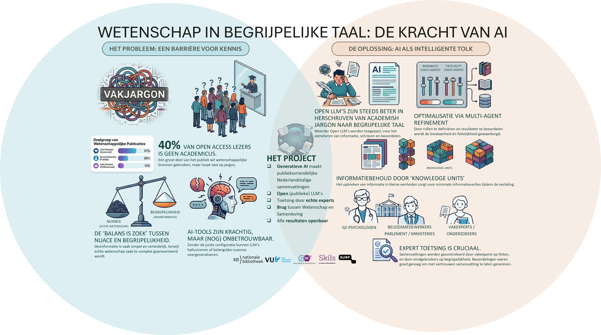

# Wetenschap in begrijpelijke taal

> Wetenschappelijke open-accessartikelen begrijpelijk maken voor Nederlandstalige niet-academische doelgroepen met behulp van open en betrouwbare generatieve AI.

Deze repository documenteert **Wetenschap in begrijpelijke taal**, een samenwerking tussen:

- [KB Nationale Bibliotheek](https://www.kb.nl/)
- [Vrije Universiteit Amsterdam – Universiteitsbibliotheek](https://www.ub.vu.nl/)
- [VU AI & Behaviour-groep](https://vu.nl/nl/over-vu/meer-over/artificial-intelligence)
- [Parlement & Wetenschap](https://www.knaw.nl/nl/over-de-knaw/wat-doet-de-knaw/parlement-wetenschap)
- [SKILS – praktijk voor psychologie & coaching](https://www.skils.nl/)
- [SURF – AI-hub & Research Cloud](https://www.surf.nl/nl)

Het project onderzoekt hoe **large language models (LLM’s)** **betrouwbare en begrijpelijke publieksvriendelijke samenvattingen** van wetenschappelijke artikelen in het Nederlands kunnen genereren, afgestemd op echte gebruikers zoals **GZ-psychologen** en **beleidsadviseurs** in het Nederlandse parlement. 

---

---

## Inhoudsopgave

1. [Motivatie](#motivatie)  
2. [Projectdoelen](#projectdoelen)  
3. [Wat we bouwen](#wat-we-bouwen)  
   - [AI-pijplijn & methodiek](#ai-pijplijn--methodiek)  
   - [Demotool (prototype)](#demotool-prototype)  
   - [Open code, prompts & data](#open-code-prompts--data)  
4. [Onderzoekskader](#onderzoekskader)  
5. [Projectorganisatie](#projectorganisatie)  
6. [Tijdlijn & status](#tijdlijn--status)  
7. [Gerelateerde repositories & projecten](#gerelateerde-repositories--projecten)  
8. [Citeren](#citeren)  
9. [Contact](#contact)  
10. [Licentie](#licentie)  

---

## Motivatie

Open science heeft ervoor gezorgd dat steeds meer onderzoeksartikelen **vrij toegankelijk** zijn, maar daarmee nog niet **begrijpelijk**.

- Ongeveer **40% van open-accessartikelen wordt gelezen door niet-academische doelgroepen** (docenten, zorgprofessionals, beleidsmakers, burgers).  
  Zie *Open for All: Exploring the reach of open access content to non-academic audiences* (Wirsching et al., 2020).  
  <https://doi.org/10.5281/zenodo.4143313>
- Deze lezers hebben vaak moeite met **jargon, complexe zinnen en abstract taalgebruik**. :contentReference[oaicite:1]{index=1}
- Tegelijkertijd verspreidt **desinformatie** zich makkelijk online omdat het vaak wordt geschreven in **eenvoudige, aansprekende taal**. :contentReference[oaicite:2]{index=2}

Onderzoekers worden ondertussen steeds vaker gevraagd om:

- **maatschappelijke impact** aantoonbaar te maken,
- **wetenschapscommunicatie** en **public engagement** te doen,
- en onderzoeksresultaten toegankelijk te maken voor een breed publiek.

Maar goede publieksvriendelijke samenvattingen schrijven is **tijdrovend** en vraagt specifieke vaardigheden.

Generatieve AI biedt een kans — maar huidige tools zijn **niet transparant, niet altijd betrouwbaar, en vaak afhankelijk van Big Tech**. We hebben **open, toetsbare en publieke** alternatieven nodig.

---

## Projectdoelen

Het project ontwikkelt en valideert een **AI-gebaseerde methode** die:

1. **Nederlandse publieksvriendelijke samenvattingen** genereert van wetenschappelijke artikelen, afgestemd op:
   - GZ-psychologen en zorgprofessionals,
   - beleidsmedewerkers in parlement en ministeries,
   - andere niet-academische professionals.
2. Waar mogelijk gebruikmaakt van **open en/of publiek beheerde LLM’s** (zoals [WiLLMa – GPT-NL](https://www.gpt-nl.nl/), via [SURF AI-hub](https://www.surf.nl/nl)).
3. Volledig **transparant en reproduceerbaar** is:
   - open prompts,
   - open code,
   - gedocumenteerde pijplijn en evaluatiemethodiek.
4. **Sterk leunt op de brontekst**:
   - zo min mogelijk hallucinaties,
   - behoud van nuance.
5. **Schaalbaar** is voor bibliotheken en contentplatforms.

Zo willen we de kloof tussen open access en **echte toegankelijkheid** verkleinen en de rol van bibliotheken als **betrouwbare intermediairs** versterken. 

---

## Wat we bouwen

### AI-pijplijn & methodiek

We ontwikkelen een samenvattingspijplijn gebaseerd op:

- **Prompt engineering & persona’s**  
  Doelgroepgerichte prompts (bv. *“Leg dit uit aan een Nederlandse GZ-psycholoog”*, *“Leg dit uit aan een beleidsadviseur”*).  
  Zie voorbeeldrepo: <https://github.com/ubvu/Layman_Summaries> :contentReference[oaicite:4]{index=4}
- **Meerdere LLM-configuraties**  
  We experimenteren met:
  - open modellen (gpt-oss, Gemma 3, TranslateGemma) 
  :contentReference[oaicite:5]{index=5}
- **Retrieval-Augmented Generation (RAG)**  
  Om modellen direct aan de oorspronkelijke brontekst te koppelen.
- **Evaluatie met echte gebruikers**  
  - Feitelijke correctheid door bibliothecarissen en domeinexperts,
  - leesbaarheid & bruikbaarheid door GZ-psychologen en beleidsmedewerkers.
- **Automatische metrics** (gebaseerd op LLM as a judge) :contentReference[oaicite:6]{index=6}  
  - Leesbaarheid en feitelijkheid-checking door LLMs.

---

### Demotool (prototype)

We bouwen een **onderzoeksprototype** waarmee gebruikers:

1. Een wetenschappelijk artikel kunnen uploaden (PDF).  
2. Een **doelgroep** kunnen kiezen (bv. GZ-psycholoog, beleidsmedewerker, algemeen).  
3. Een samenvatting kunnen genereren:
   - een gestructureerde expertsamenvatting,
   - een toegankelijke publieksvriendelijke samenvatting,
   - kwaliteitsindicatoren (leesbaarheid, feitelijkheid, enz.).
4. Verschillende **modellen + prompts** kunnen vergelijken.

De tool wordt ontwikkeld in **python** en **Marimo**. Het draait op:

- [Een github pagina](https://github.com), 
- Met de modellen in verschillende omgevingen waaronder: [VU Nebula AI-infrastructuur](https://networkinstitute.org/), [SURF AI-hub](https://www.surf.nl/nl) en custom OpenAI endpoints.  

De code wordt beschikbaar gesteld in de repository [WIBT-Tool](https://github.com/ubvu/wibt-tool) zodra de eerste publieke versie stabiel is.

---

### Open code, prompts & data

Het project levert de volgende open resources: 

- **[D1] Technisch rapport**  
  Documentatie van pijplijn, prompts, experimenten en resultaten.  
  Publicatie: *UKB Zenodo Community* – <https://zenodo.org/communities/ukb/>

- **[D2] Open GitHub-repositories met code, prompts & benchmarkdata**  
  - Voorbeelden / voorgangers:  
    - <https://github.com/ubvu/ResearchMadeReadable>  
    - <https://github.com/ubvu/Layman_Summaries>  
  - De repository (**https://github.com/ubvu/wibt**) fungeert als **publieke documentatie en landing page**.

- **[D3] Demonstratieplatform (prototype)**  
  Python- en Marimo-gebaseerd, voor workshops en evaluaties.

- **[D4] Open-accesspublicatie**  
  Te publiceren via de [VU Journal Browser](https://journalpublishingguide.vu.nl/).

- **[D5] Communicatiematerialen**  
  Gericht op:
  - bibliotheken (UKB, SHB),
  - open access platforms (bv. [openjournals.nl](https://openjournals.nl/)),
  - uitgevers (bv. Elsevier),
  - discovery platforms (WorldCat, OpenAIRE),
  - citizen science en kennisplatforms (openresearch.amsterdam, Kenniscloud),
  - netwerken als [NEWS – Wetenschap & Samenleving](https://wetenschapensamenleving.nl/).  
  

---

## Onderzoekskader

Belangrijke bevindingen uit de literatuur: :contentReference[oaicite:11]{index=11}

- **Leesbaarheid**  
  LLM’s produceren vaak **leesbaardere** samenvattingen dan onderzoekers.  
  Soms tot **80% verbeterde scores**.

- **Factuality & bias**  
  Modellen hallucinerem of generaliseren soms te veel.  
  Voorzichtigheid is nodig bij subtiele of onzekere bevindingen.

- **Mens + AI werkt het beste**  
  LLM’s geven een goede eerste versie;  
  experts corrigeren nuances en fouten.

- **Methodieken**  
  RAG, multi-agent workflows en geavanceerde evaluatiemethoden hebben veel invloed op de kwaliteit.

De volledige presentatie:  
**State of the Art in LLM-Generated Lay Summaries of Scientific Articles**.  
:contentReference[oaicite:12]{index=12}

---

## Projectorganisatie

### Kernteam

- **Astrid van Wesenbeeck** – Projectcoördinatie / Chief Open Science, KB  
- **Maurice Vanderfeesten** – Bibliotheekliaison / Innovatiemanager, VU UB  
- **Michel Klein** – Methodologie & begeleiding, VU AI & Behaviour  
- **Githa Wijbenga** – Methodologie & begeleiding, VU AI & Behaviour  
- **Geoffrey Frankhuizen** – Prompt engineering, surveys, ontwikkeling  
- **Heleen van Manen** – Programmaleider PICA - Wetenschap en publiek, KB  

### Gebruikersgroepen

- **Beleidsmedewerkers Tweede Kamer**  
  Contact: **Hugo van Bergen**, Parlement & Wetenschap  
- **GZ-psychologen & zorgprofessionals**  
  Contact: **Ulrika Léons**, SKILS
- **Wetenschappelijke informatie Specialisten**  
  Contact: **Pam Kaspers**, VU Universiteitsbibliotheek 

### Governance

We werken met:

- een **stuurgroep** (infrastructuur, afstemming, strategie),
- een **adviesgroep** (publieke waarden, maatschappelijke impact).  
  Uitkomsten worden gedeeld met o.a.: NEWS (netwerk wetenschap en samenleving), SURF, Waag Future Lab, VU Impact Board.  
  

---

## Tijdlijn & status

Totale duur: **12 maanden**. 

1. **Maand 1–3 – Voorbereiding**
2. **Maand 4–7 – Experimenten**
3. **Maand 8–9 – Analyse**
4. **Maand 10–11 – Rapportage**
5. **Maand 12 – Disseminatie**

Statusupdates komen beschikbaar via  
<https://github.com/ubvu/wibt/projects> (wanneer geactiveerd).

---

## Gerelateerde repositories & projecten

- 🔬 **Onderzoeksprototype & platform**  
  <https://github.com/ubvu/ResearchMadeReadable>

- 🧠 **Prompt templates voor publieksvriendelijke samenvattingen**  
  <https://github.com/ubvu/Layman_Summaries>

- 🇳🇱 **GPT-NL / WiLLMa**  
  <https://www.gpt-nl.nl/>  
  SURF demoportal: <https://fred.surf.nl/>
  SURF AI-Hub backend: <https://willma.surf.nl>

- 📊 **Open-access-leesgedrag**  
  *Open for All* (Wirsching et al., 2020): <https://doi.org/10.5281/zenodo.4143313>

Deze GitHub Pages-site:  
**https://ubvu.github.io/wibt/**  
vormt de centrale projectpagina.

---

## Citeren

Aanbevolen voorlopige citatie:

> Vanderfeesten, M., van Wesenbeeck, A., Klein, M., et al. (2025). *Wetenschap in begrijpelijke taal: LLM-gebaseerde publieksvriendelijke samenvattingen van wetenschappelijke artikelen.* Projectdocumentatie. Verkregen van <https://ubvu.github.io/wibt/>

Zodra het technische rapport en het wetenschappelijke artikel zijn gepubliceerd, deze graag gebruiken.

---

## Contact

- **Astrid van Wesenbeeck** – KB  
  `astrid.vanwesenbeeck@kb.nl`
- **Maurice Vanderfeesten** – VU UB  
  `maurice.vanderfeesten@vu.nl`
- **Michel Klein** – VU AI & Behaviour  
  `michel.klein@vu.nl`

Of maak een Issue aan in de repository:  
<https://github.com/ubvu/wibt/issues>

---

## Licentie

De **code** uit aanverwante repositories is open source (MIT of Apache 2.0).  
De **inhoud van deze README en projectdocumentatie** valt onder  
[CC BY 4.0](https://creativecommons.org/licenses/by/4.0/), tenzij anders vermeld.

Zie het `LICENSE`-bestand in deze repository.
